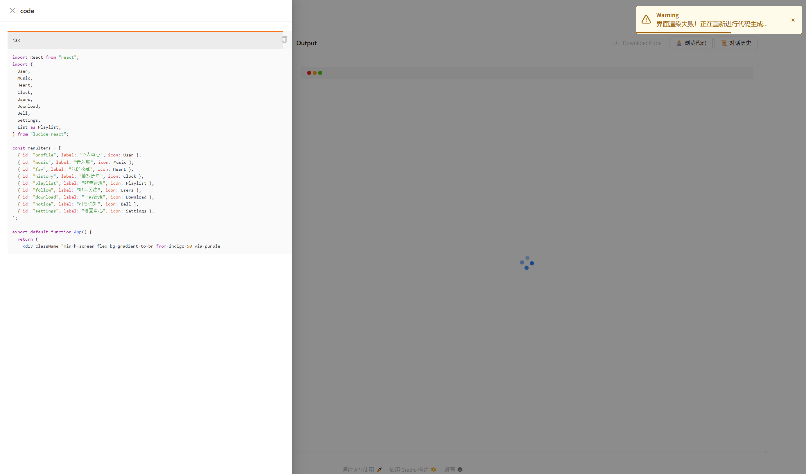

<p align="center">
  <picture>
    
  </picture>
</p>

## 📝 关于

AutoFrontend 是一款基于 Gradio 开发的前端代码自动生成工具 。通过简单输入界面设计需求（如布局、组件、交互逻辑等），工具可实时生成对应的前端代码，并同步预览界面效果，无需手动编写复杂代码，让前端开发更高效 ✨。


## 🚀 快速开始
### 1. 克隆项目

```bash
git clone https://github.com/LE1X1N/AutoFrontend.git
cd AutoFrontend
```

### 2. 安装依赖

```bash
pip install -r requirements.txt
```

### 3. 配置修改

修改 **config/openai_conf.yaml** 下对应模型的相关模型配置。
``` yaml
# openai config
base_url: http://localhost:8001/v1
api_key: sk-XXXXXX
model: Qwen3
```

### 4. 项目启动
``` bash
python app.py
```

## 🌟 项目特点

### 1. 丰富前端依赖支持

内置多种主流前端库与框架，生成的代码可直接集成以下工具：

- "semantic-ui-react": "https://esm.sh/semantic-ui-react@2.1.5"
- "semantic-ui-css": "https://esm.sh/semantic-ui-css@2.5.0"
- "styled-components": "https://esm.sh/styled-components@6.1.19"
- "@tailwindcss/browser": "https://esm.sh/@tailwindcss/browser@4.1.11"
- "lucide-react": "https://esm.sh/lucide-react@0.525.0"
- "framer-motion": "https://esm.sh/framer-motion@12.23.6"
- "matter-js": "https://esm.sh/matter-js@0.20.0"
- "three": "https://esm.sh/three@0.178.0"
- "@react-three/fiber": "https://esm.sh/@react-three/fiber@9.2.0"
- "@react-three/drei": "https://esm.sh/@react-three/drei@10.5.2"
- "recharts": "https://esm.sh/recharts@3.1.0"
- "konva": "https://esm.sh/konva@9.3.22"
- "react-konva": "https://esm.sh/react-konva@19.0.7"
- "p5": "https://esm.sh/p5@2.0.3"
- "dayjs": "https://esm.sh/dayjs"

### 2. 智能失败重试
当模型生成代码出现语法错误时，工具会自动检测异常，进行新一轮代码生成。


### 3. 多场景模板支持

支持扩展多种前端模板，如小程序、网站等，提升生成效率。

### 4. 支持多轮优化
若对生成结果不满意或需要微调（如调整颜色、修改布局、增加交互等），可通过对话方式持续向模型提出优化需求，系统会基于历史对话上下文进行迭代优化，逐步完善前端实现效果。


### 5. 完整日志记录
自动记录每次生成操作的日志，便于开发者追溯历史操作、排查问题。


